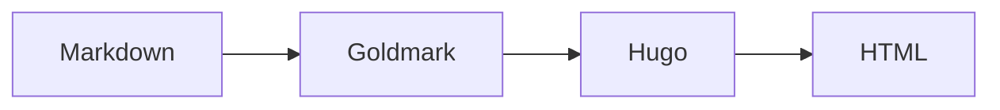
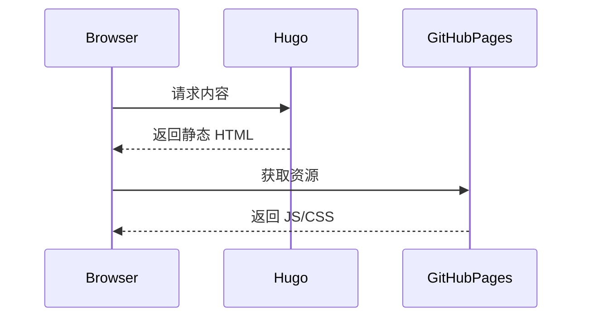
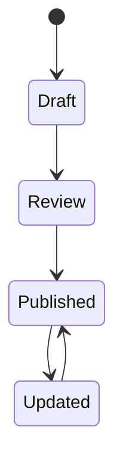

## 流程图

```mermaid
flowchart LR
    A[Markdown] --> B[Goldmark]
    B --> C[Hugo]
    C --> D[HTML]
```

## 时序图

```mermaid
sequenceDiagram
    participant Browser
    participant Hugo
    participant GitHubPages

    Browser->>Hugo: 请求内容
    Hugo-->>Browser: 返回静态 HTML
    Browser->>GitHubPages: 获取资源
    GitHubPages-->>Browser: 返回 JS/CSS
```

## 状态图

```mermaid
stateDiagram-v2
    [*] --> Draft
    Draft --> Review
    Review --> Published
    Published --> Updated
    Updated --> Published
```

Mermaid 只在包含 `mermaid` 代码块的页面加载。
